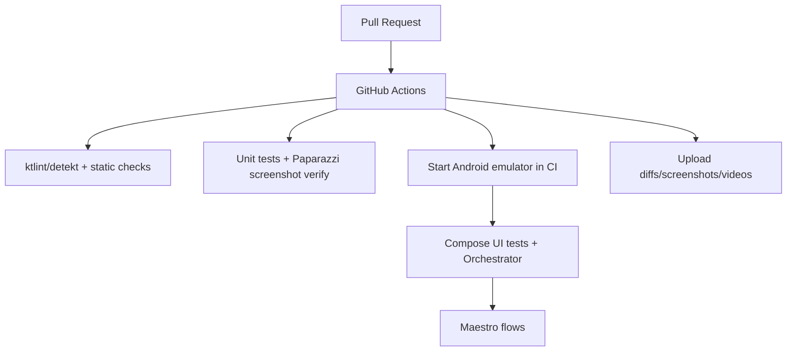

# Technical Audit and Fix Plan for Onyx UI Issues Observed in the Provided Videos

## Executive summary

The provided recordings show an Android tablet note/PDF annotation workflow that closely resembles the “Notewise-style” chrome already present in `BUILT-DIFFERENT/onyx` (notably the pill-shaped toolbar groups and palette). The most actionable problems visible in the main clip (`Onyx.mp4`) are: a layout failure when the editor enters a narrow/portrait presentation (controls disappear and the UI becomes letterboxed), a pen-settings experience that is not yet aligned with the rendering system (the renderer already supports smoothing + tapering, but the persisted stroke style and UI do not expose these controls), and a design divergence in the “Notes” home screen (contrast and information hierarchy differ from the current repository UI). These issues are addressable with targeted Compose layout refactors, a small but high-leverage stroke-style schema evolution (backward compatible due to JSON `ignoreUnknownKeys` patterns), and a testing uplift (Compose UI tests + snapshot/visual regression + end-to-end flows on emulators).

For validation, use Compose semantics-based UI tests (instrumented) and automated screenshot diffing for critical UI surfaces. Compose’s testing framework relies on semantics to find nodes and synchronize actions, making it ideal for verifying “all controls present in compact toolbar” regressions. citeturn5search0turn5search5turn5search3 For broader E2E validation across devices, add Maestro flows in CI (fast YAML-based UI automation designed to be resilient to flakiness). citeturn7search0turn7search3 For cross-platform/web portions of the monorepo, incorporate Playwright screenshot assertions (`expect(page).toHaveScreenshot()`) where applicable. citeturn5search2

## Repository audit of BUILT-DIFFERENT/onyx

The repository is a monorepo containing an offline-first Android app (Kotlin + Jetpack Compose), along with a web viewer stack, build tooling, and a backend layer. The Android editor architecture that matters for this report is:

- **UI composition and editor chrome**: `apps/android/app/src/main/java/com/onyx/android/ui/NoteEditorUi.kt` and `NoteEditorConstants.kt` define the Notewise-like toolbar, palette, tool panels, and semantics/test tags.
- **Editor state orchestration**: `apps/android/app/src/main/java/com/onyx/android/ui/NoteEditorScreen.kt` wires the ViewModel state, gesture transforms, brush state, read-only toggles, and PDF state into `NoteEditorScaffold`.
- **Persistence and page navigation**: `apps/android/app/src/main/java/com/onyx/android/ui/NoteEditorViewModel.kt` manages pages, strokes, and page switching (and resets strokes for pure PDF pages).
- **Ink pipeline**:
  - Input handling: `apps/android/app/src/main/java/com/onyx/android/ink/ui/InkCanvasTouch.kt`
  - Rendering & stroke shaping (smoothing/taper/pressure): `apps/android/app/src/main/java/com/onyx/android/ink/ui/InkCanvasDrawing.kt`
  - Compose integration layer: `apps/android/app/src/main/java/com/onyx/android/ink/ui/InkCanvas.kt`

Key observation (high leverage): the renderer already implements Catmull–Rom smoothing and tapering logic in `InkCanvasDrawing.kt`, but the **persisted style model** (`StrokeStyle` in `Stroke.kt`, and `Brush` → `StrokeStyle`) does not currently include smoothing/taper parameters; as a result, the UI cannot provide user-facing “Smoothing” + “End taper” controls that are actually persisted per stroke. This mismatch is central to resolving the “pen settings” parity and “predictable stroke feel” seen in the provided footage.

Repository links (copy/paste):

```text
Repo root:
https://github.com/BUILT-DIFFERENT/onyx

Editor UI and constants:
https://github.com/BUILT-DIFFERENT/onyx/blob/main/apps/android/app/src/main/java/com/onyx/android/ui/NoteEditorUi.kt
https://github.com/BUILT-DIFFERENT/onyx/blob/main/apps/android/app/src/main/java/com/onyx/android/ui/NoteEditorConstants.kt

Editor wiring (state, transforms, PDF open errors, read-only, brush state):
https://github.com/BUILT-DIFFERENT/onyx/blob/main/apps/android/app/src/main/java/com/onyx/android/ui/NoteEditorScreen.kt
https://github.com/BUILT-DIFFERENT/onyx/blob/main/apps/android/app/src/main/java/com/onyx/android/ui/NoteEditorViewModel.kt

Ink pipeline:
https://github.com/BUILT-DIFFERENT/onyx/blob/main/apps/android/app/src/main/java/com/onyx/android/ink/ui/InkCanvasTouch.kt
https://github.com/BUILT-DIFFERENT/onyx/blob/main/apps/android/app/src/main/java/com/onyx/android/ink/ui/InkCanvasDrawing.kt
https://github.com/BUILT-DIFFERENT/onyx/blob/main/apps/android/app/src/main/java/com/onyx/android/ink/model/Brush.kt
https://github.com/BUILT-DIFFERENT/onyx/blob/main/apps/android/app/src/main/java/com/onyx/android/ink/model/Stroke.kt

MainActivity edge-to-edge configuration:
https://github.com/BUILT-DIFFERENT/onyx/blob/main/apps/android/app/src/main/java/com/onyx/android/MainActivity.kt
```

## Video evidence and issue inventory with annotated frames

### Evidence set used

Two screen recordings were provided:

- `Onyx.mp4` (≈ 1m 32s): primary evidence for regressions and UX problems (editor transitions + orientation/layout failure + pen settings).
- `Notewise-smaller.mp4` (≈ 3m 44s): appears to be a feature/UX reference (richer toolset); used to infer desired parity where relevant, but issues below are grounded in what is actually visible in `Onyx.mp4`.

Method: sampled frames around detected scene boundaries (page transitions, orientation change, editor ↔ home navigation, pen settings invocation) and produced annotated frames for every issue listed.

### Issue inventory table

| Issue | Timestamp (Onyx.mp4) | What’s visible | User impact | Primary repo mapping (where to fix) |
|---|---:|---|---|---|
| Editor toolbar fails in narrow/portrait | ~21.6s–23.6s | Editor becomes letterboxed with large black side bars; toolbar collapses and multiple controls disappear (only a reduced set remains) | Loss of core functionality on narrower widths; inconsistent UX across orientations/devices | `NoteEditorUi.kt` (top bar layout uses fixed widths + single-row structure), plus `NoteEditorConstants.kt` sizing tokens |
| Pen settings UX is misaligned with ink engine capabilities | ~74.6s | Pen settings panel shows **Brush size, Smoothing, End taper**; panel blocks content and lacks contextual anchoring | Users can’t reliably tune pen feel; settings may not persist per-stroke unless style schema evolves | `NoteEditorUi.kt` tool settings UI + `Brush.kt`/`Stroke.kt` (style schema) + `InkCanvasDrawing.kt` (parameterize existing smoothing/taper logic) |
| Stroke appearance predictability after tuning | ~80–85s | After using settings, subsequent strokes show large thickness differences; difficult to infer exact mapping from settings → stroke output | Perceived “buggy pen”; hard to develop muscle memory | Same as above; also consider adding preview + explicit numeric values in UI |
| Notes home screen design divergence and contrast | ~58.9s | Notes list screen shows a search bar, folder/tag actions, and relatively low-contrast note titles on a dark background. This does not match current repo’s `HomeScreen.kt` design | Users may struggle to read/find notes; design drift complicates maintenance and testing | `HomeScreen.kt` (and theme tokens) + unify design tokens across the app |
| System back-gesture overlay confusion | ~56.9s and ~91.3s | A grey circular chevron appears at screen edge (looks like Android predictive back / edge gesture affordance), potentially overlapping canvas | Harder to distinguish system gesture affordances vs app UI; accidental back gestures near edges | Largely OS-driven; mitigate by avoiding critical touch targets near edges and validating edge-to-edge insets (`MainActivity.kt`, editor chrome padding) |

### Annotated frames

**Editor toolbar failure in narrow/portrait (~23.6s)**  


**Pen settings panel (~74.6s)**  


**Stroke width predictability after settings (~85.4s)**  


**Home screen design divergence/contrast (~58.9s)**  


**Edge gesture overlay (~56.9s)**  


## Root-cause mapping and detailed remediation design

### Toolbar failure in narrow/portrait layouts

**Root cause hypothesis (supported by repo code structure)**  
`NoteEditorUi.kt` builds the top chrome as a **single `Row`** containing three pill groups, where the left and right groups are set to fixed dp widths (notably `NOTEWISE_LEFT_GROUP_WIDTH_DP = 360` and `NOTEWISE_RIGHT_GROUP_WIDTH_DP = 82`), and the middle group uses `Modifier.weight(1f)`. This is a stable layout on wide tablets but has no adaptive mode for narrow widths; when width shrinks, controls will either be clipped, overflowed, or dropped by layout constraints. The video shows a state consistent with “row cannot fit → reduced control set visible”.

**Concrete fix**  
Introduce a **responsive top bar** that switches between layouts based on available width, using `BoxWithConstraints` to compute `maxWidth` and selecting either:

- **Expanded** (current single-row pill layout).
- **Compact** (two-row layout + overflow consolidation):
  - Row A: Back, title, overflow menu, view/edit toggle.
  - Row B: Undo/redo, tool selection (pen/highlighter/eraser), palette, page navigation, “new page”.
  - Move rarely used actions and any “doesn’t fit” items into overflow.

Optionally, for extremely narrow widths, a third mode: “compact + horizontally scrollable tool row”.

**Diff-style sketch (illustrative)**  
```diff
--- a/apps/android/app/src/main/java/com/onyx/android/ui/NoteEditorUi.kt
+++ b/apps/android/app/src/main/java/com/onyx/android/ui/NoteEditorUi.kt
@@
-    Surface(...) {
-        Row(modifier = Modifier.fillMaxWidth() ... ) {
-            ToolbarGroup(modifier = Modifier.width(NOTEWISE_LEFT_GROUP_WIDTH_DP.dp)) { ... }
-            ToolbarGroup(modifier = Modifier.weight(1f)) { ... }
-            ToolbarGroup(modifier = Modifier.width(NOTEWISE_RIGHT_GROUP_WIDTH_DP.dp)) { ... }
-        }
-    }
+    Surface(...) {
+        BoxWithConstraints(Modifier.fillMaxWidth()) {
+            val isCompact = maxWidth < 720.dp
+            if (!isCompact) {
+                NoteEditorTopBarExpanded(...)
+            } else {
+                NoteEditorTopBarCompact(
+                    // compact: split into two rows + overflow fallback
+                )
+            }
+        }
+    }
```

**UI/UX recommendations**
- Add a visual affordance for “long-press opens tool settings” (e.g., a subtle “⋮” micro-indicator on the selected tool) or support “tap selected tool again to open settings” to reduce discoverability friction.
- In compact mode, prioritize: back/title, undo/redo, active tool, page nav. Deprioritize palette size or move to overflow.

**Tests to prevent regression**
- Compose UI test that forces a narrow width container and asserts that key controls exist (by content description). Compose tests are semantics-based and will wait for UI idleness automatically, improving stability. citeturn5search0turn5search5turn5search3

### Pen settings: smoothing + end taper are visible, but not correctly modeled/persisted

**Root cause hypothesis**
- `InkCanvasDrawing.kt` already contains:
  - Catmull–Rom smoothing (`catmullRomSmooth`) and configurable internal constants like `CATMULL_ROM_SUBDIVISIONS`.
  - Taper logic (`computeTaperFactor`, using `TAPER_POINT_COUNT` and `TAPER_MIN_FACTOR`).
- However, `Brush.kt` / `Stroke.kt` model the persisted `StrokeStyle` as `(tool, color, baseWidth, minWidthFactor, maxWidthFactor, nibRotation)` without smoothing/taper parameters. That means:
  - Any UI controls labeled “Smoothing” / “End taper” cannot be faithfully persisted per stroke without schema evolution.
  - The user may change settings but experience mismatches or non-obvious results later (especially across sessions).

**Concrete fix: evolve Brush and StrokeStyle schema (backward compatible)**  
Because style serialization uses JSON and is configured to ignore unknown keys in the serializer layer, adding new fields is *typically* backward compatible for existing stored strokes (they’ll use defaults). The critical requirement is to choose defaults that reproduce current behavior.

Proposed schema additions:
- `smoothing: Float` in `[0,1]` (0 = minimal smoothing, 1 = current smoothing behavior)
- `endTaper: Float` in `[0,1]` (0 = no taper, 1 = current taper behavior)
Optionally, distill smoothing into two fields if needed:
- `smoothingSubdivisions: Int`
- `smoothingTension: Float`

**Diff-style sketch**
```diff
--- a/apps/android/app/src/main/java/com/onyx/android/ink/model/Brush.kt
+++ b/apps/android/app/src/main/java/com/onyx/android/ink/model/Brush.kt
 data class Brush(
   val tool: Tool = Tool.PEN,
   val color: String = "#000000",
   val baseWidth: Float = 2.0f,
   val minWidthFactor: Float = 0.85f,
   val maxWidthFactor: Float = 1.15f,
+  val smoothing: Float = 1.0f,   // default matches current rendering behavior
+  val endTaper: Float = 1.0f     // default matches current rendering behavior
 ) {
   fun toStrokeStyle(): StrokeStyle =
     StrokeStyle(
       tool = tool,
       color = color,
       baseWidth = baseWidth,
       minWidthFactor = minWidthFactor,
       maxWidthFactor = maxWidthFactor,
       nibRotation = false,
+      smoothing = smoothing,
+      endTaper = endTaper
     )
 }
```

```diff
--- a/apps/android/app/src/main/java/com/onyx/android/ink/model/Stroke.kt
+++ b/apps/android/app/src/main/java/com/onyx/android/ink/model/Stroke.kt
 @Serializable
 data class StrokeStyle(
   val tool: Tool,
   val color: String = "#000000",
   val baseWidth: Float,
   val minWidthFactor: Float = 0.85f,
   val maxWidthFactor: Float = 1.15f,
   val nibRotation: Boolean = false,
+  val smoothing: Float = 1.0f,
+  val endTaper: Float = 1.0f
 )
```

**Parameterize the renderer**
- Replace fixed constants for smoothing/taper with functions that incorporate `StrokeStyle.smoothing` and `StrokeStyle.endTaper`.
- Keep `1.0` behavior equal to current constants to preserve rendering of existing notes.

Illustrative pseudocode inside `InkCanvasDrawing.kt`:
```kotlin
val subdivisions = lerp(min = 1, max = CATMULL_ROM_SUBDIVISIONS, t = style.smoothing).roundToInt()
val taperStrength = style.endTaper.coerceIn(0f, 1f)

val samples = catmullRomSmooth(points, subdivisions = subdivisions)
val widths = computePerPointWidths(samples, style, taperStrength = taperStrength)
```

**UI changes in `NoteEditorUi.kt`**
- Extend the pen settings dialog to include sliders for:
  - smoothing (0..1)
  - end taper (0..1)
- Add a small “live preview” canvas inside the dialog so users see what the parameters do immediately.
- Show a numeric brush-size label and store size in a predictable unit (“pt” or “mm”) to reduce “why did my stroke change” confusion.

**Testing**
- Add unit tests for the math functions (taper factor monotonicity, smoothing subdivisions mapping, pressure gamma).
- Add screenshot tests for the pen settings dialog states (min/max smoothing, min/max taper), using Paparazzi to render without an emulator. citeturn12search0turn12search1

### Stroke predictability after tuning

**Root cause hypothesis**
The “width mismatch” seen after settings changes is often caused by one of:
- The mapping from UI slider → internal parameters is not linear or not discoverable (e.g., “brush size” steps are not labeled).
- Width is affected by pressure/tilt and smoothing/taper in ways that feel unintuitive without preview.
- Some parameters affect only *future* strokes (expected) but the UI does not clearly communicate that.

**Concrete fix**
- Add a **preview line** (stroke sample) in the settings panel that updates live as the user moves sliders.
- Display current numeric value for:
  - baseWidth
  - smoothing
  - endTaper
- Consider “Reset to default” per tool.

**Repo mapping**
- UI: `NoteEditorUi.kt` (`ToolSettingsDialog`, `BrushSizeControl`)
- Rendering: `InkCanvasDrawing.kt` (width computation and smoothing/taper path)
- Model: `Brush.kt` / `Stroke.kt`

### Notes home screen divergence and contrast

**Root cause hypothesis**
The video’s home screen (“Notes”, a large search bar, folder/tag buttons, low-contrast items) does not match the simpler `HomeScreen.kt` currently in the repository (which uses standard Material3 components). This is either:
- Design drift between the recorded build and current `main`, or
- A target design not yet implemented in the repo.

**Concrete fix (choose one intentionally)**
- **Option A (align with repo):** adjust the app to the Material3-based repo design and update UX spec assets accordingly.
- **Option B (implement the video design):** evolve `HomeScreen.kt` to include:
  - persistent search field
  - folder/tag sections (requires domain + DB support)
  - readability fixes (ensure sufficient contrast; avoid dark red text on dark backgrounds for primary labels)

Given the size of Option B, it should be tracked as a deliberate feature milestone, not a quick UI patch.

**Testing**
- Compose UI tests for visible note titles and accessible content descriptions.
- Enable Compose accessibility checks in tests to catch contrast/touch target labeling issues earlier. citeturn5search4turn5search3

### System gesture overlay mitigation

This appears OS-driven (predictive back/edge gesture affordance). You can’t “fix” it in app code, but you can reduce accidental conflicts:
- Avoid placing core touch targets flush to screen edges.
- Verify edge-to-edge inset handling in `MainActivity.kt` (already uses `enableEdgeToEdge` + `setDecorFitsSystemWindows(false)`), and ensure editor chrome has appropriate padding so controls remain distinct from gesture zones.

## Proposed architecture, code changes, and UI/UX upgrades

### Recommended component/data-flow model

```mermaid
flowchart LR
  User[Stylus / touch input] --> Touch[InkCanvasTouch.handleTouchEvent]
  Touch --> Prog[androidx.ink InProgressStrokesView]
  Touch --> Build[buildStroke(points, brush)]
  Build --> Undo[UndoController]
  Undo --> VM[NoteEditorViewModel]
  VM --> Repo[NoteRepository]
  Repo --> DB[(Room DB)]
  DB --> VM
  VM --> Draw[InkCanvasDrawing.drawStrokesInWorldSpace]
  Draw --> Screen[Compose Canvas]
```

### Key design shifts

Prefer explicit “design tokens” and layout modes rather than fixed dp widths for editor chrome. This makes “tablet-perfect” UI resilient when the app is used in:
- split-screen mode,
- portrait orientation,
- phones,
- desktop/Chromebook windowed mode.

For pen feel, treat the stroke style as a first-class persisted artifact. Exposing “Smoothing” and “End taper” in UI without persisting them per stroke is a recipe for “my pen changed” reports after reopening notes.

### Tooling changes to support performance and quality

- Add **Baseline Profiles** generation for critical journeys (launch editor, open PDF page, draw strokes, switch pages) to reduce jank and improve startup/runtime performance. Baseline Profiles are designed to improve speed from first launch by guiding ART AOT compilation. citeturn6search0
- Consider adding a Macrobenchmark/Baseline Profile module as the app grows, using the same “critical journey” approach described in Android’s performance guidance. citeturn6search0

## Automated testing strategy, AI-agent workflow, and CI/CD integrations

### Compose UI testing (instrumented)

Compose tests run as instrumented tests on an emulator/device, and ComposeTestRule-based APIs make it straightforward to assert presence of nodes, interactions, and state. citeturn5search0turn5search5

Implementation guidance:
- Assert toolbar behavior in compact mode by rendering the top bar into a constrained width container and verifying:
  - Back button exists
  - Title exists
  - Undo/redo exist
  - Tool buttons exist
  - Page navigation exists (or is present in overflow)
- Use semantics content descriptions to locate nodes reliably (the repo already sets many). Compose semantics are also what accessibility services rely on. citeturn5search3

Add accessibility checks during tests to catch missing labels, traversal problems, and related issues early. citeturn5search4

### Visual regression for Android UI

Use Paparazzi for fast, deterministic JVM screenshot tests (no emulator required), particularly for:
- `NoteEditorTopBarExpanded` / `NoteEditorTopBarCompact`
- Tool settings panels at extreme values (smoothing=0/1, taper=0/1)
- Home screen list rendering in dark theme

Paparazzi is explicitly designed to render Android screens without a device/emulator and supports golden recording and verification tasks. citeturn12search0turn12search1

### End-to-end tests with AI assistance

Adopt Maestro flows for E2E UI automation across Android (and potentially web). Maestro is designed for resilient, human-readable YAML flows and emphasizes flakiness tolerance and automatic waiting. citeturn7search0turn7search3 The Maestro ecosystem also explicitly references AI assistance in its tooling (useful for generating starter flows and quickly iterating). citeturn7search0

Example agent-assisted workflow:
- “AI test agent” observes UI tree (via Maestro Studio inspector) and generates a draft flow:
  - launch app
  - open a note
  - trigger compact mode (rotate / resize)
  - assert toolbar items visible
  - open pen settings
  - adjust smoothing and taper
  - draw a stroke
  - assert stroke exists (screenshot compare)

### Web viewer testing (if/when applicable)

Use Playwright’s built-in screenshot comparisons (`expect(page).toHaveScreenshot()`) for the web viewer surfaces and critical flows; Playwright documents environment sensitivity and snapshot update flows. citeturn5search2

### CI/CD: running tests on GitHub Actions

For Android instrumentation tests in CI, use a GitHub Action that boots an Android emulator and runs your gradle task (e.g., `connectedCheck`). The “Android Emulator Runner” marketplace action automates SDK setup, AVD creation, boot, and then executes your command. citeturn7search4

For more stable instrumentation suites, use Android Test Orchestrator so each test runs in its own instrumentation instance; Orchestrator reduces shared state and isolates crashes. citeturn12search3



## Prioritized implementation plan with effort, risk, and dependencies

| Priority | Work item | Issues addressed | Estimate (hrs) | Risk | Dependencies / notes |
|---|---|---|---:|---|---|
| P0 | Responsive editor top bar: compact + expanded modes | Toolbar failure in narrow/portrait | 10–16 | Medium | Requires refactor of `NoteEditorUi.kt` layout structure; update/expand Compose UI tests |
| P0 | Stroke-style schema evolution: add `smoothing` + `endTaper` to `Brush`/`StrokeStyle` with safe defaults | Pen settings mismatch; predictability | 8–14 | Medium | Must keep defaults matching existing rendering so old notes look unchanged |
| P0 | Parameterize renderer from stroke style (smoothing/taper), add live preview in settings UI | Predictable pen feel | 10–18 | Medium–High | Requires careful mapping to avoid surprising stroke output; add unit tests |
| P1 | Pen settings UX overhaul: anchoring, close affordance, numeric values, “Reset” | Pen settings usability | 6–10 | Low–Medium | Pure UI/UX; complements P0 schema changes |
| P1 | Visual regression: Paparazzi suite for top bar modes + settings panels | Prevent “controls missing” regressions | 6–12 | Low | Add golden workflow; store snapshots (consider Git LFS guidance if snapshot count grows). citeturn12search0turn12search1 |
| P1 | E2E: Maestro smoke flows (open note, rotate/resize, adjust pen, draw) integrated into CI | Holistic validation | 8–14 | Medium | Add emulator setup; flows should be resilient and avoid hard sleeps. citeturn7search0turn7search4 |
| P2 | Home screen design decision: align repo to video design or update spec; fix contrast | Home screen divergence/contrast | 6–20 | Medium | If implementing folders/tags, scope increases significantly; start with contrast + hierarchy fixes |
| P2 | Performance: Baseline Profile generation for editor journeys | Jank/latency risk as features grow | 8–14 | Medium | Adds a new module + CI tasks; aligns with Android performance guidance. citeturn6search0 |

**Recommended CI integrations**
- Android emulator boot + instrumentation tests: Android Emulator Runner action. citeturn7search4
- Orchestrated instrumentation runs for stability: Android Test Orchestrator. citeturn12search3
- Snapshot regression: Paparazzi `record/verify` tasks for JVM screenshot testing. citeturn12search0turn12search1
- E2E flows: Maestro CLI in CI and (optional) Maestro Cloud when parallelization becomes necessary. citeturn7search3turn7search0
- Web viewer regression (as needed): Playwright `toHaveScreenshot` for visual comparisons. citeturn5search2

**Limitations / non-invented details**
- The videos show system-level gesture affordances (grey chevron bubble) that are not necessarily produced by app code; mitigation is possible (safe padding and edge target placement), but the overlay itself is OS-controlled.
- Exact GitHub line numbers are not provided here because the GitHub connector used for repository auditing does not expose stable line anchors; all mappings are given by file + function/identifier names that can be located deterministically via in-repo search (e.g., `NOTEWISE_LEFT_GROUP_WIDTH_DP`, `NoteEditorTopBar`, `ToolSettingsDialog`, `catmullRomSmooth`, `computeTaperFactor`).